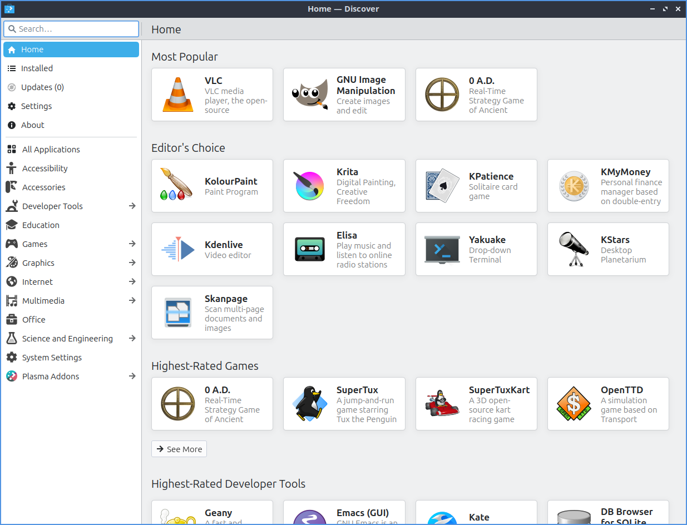

Chapter 4.1 Discover Software Center
==========================================
Discover allows you to install and remove programs and utilities. It has a simplistic interface making it easy to navigate and use. Discover however only shows GUI application packages so if you are looking for command line packages please use Muon Package Manager instead.

Usage
------
Discover allows you to search for applications by using the :guilabel:`Search` box. To search for programs in discover type in the search bar in the upper left or press :kbd:`Control + F`. To view featured applications press the blue rectangle on the top left hand corner. Clicking on a program will give you a description of it. When installing or removing software, you will be prompted for your password. You can also browse through different categories on the left clicking on the different categories. To move back from a category or search press the :guilabel:`Back` button which functions similar to the back button in a web browser. In the results after selecting your program you are looking at you can select a screenshot and get a bigger view of the screenshot click on the screenshot. To exit from the screenshot press :kbd:`Escape` or click not on the screenshot.

On the top bar there is a a back button that is is a leftward pointed arrow to move back. There is a rightward pointed arrow to go forward in your history.

To view user reviews of a program click on the text :guilabel:`Show All Reviews`. To exit the user reviews press :kbd:`Escape` or click outside the areas of reviews. Below the reviews there is information on the package such as the :guilabel:`Version` and :guilabel:`Liscense`. 

Discover allows you to update software using the Updates tab located on the bottom of the left column. You can click the :guilabel:`Check for Updates` button to check for updates manually. If you have updates that need to be installed Update with a gear and will be highlighted in orange and the number of updates that are available. When you select updates to install and have updates towards the upper left shows you the number of packages to update and the size of the download in parenthesis. To finally update press the :guilabel:`Update All` button or press :kbd:`Alt+U` to install all updates and then you will need to enter your password and press the :guilabel:`OK` button to make sure you are the one installing these updates. 

.. image:: update-authentication.png

To remove software use the :guilabel:`Installed` tab or press :kbd:`Alt +I`. You can browse your installed packages, search using the search bar (upper left corner), and the click the remove button to remove software by pressing the :guilabel:`Remove` button. If you have a program installed there will also be a :guilabel:`Launch` button will actually launch this program.

In the upper right corner of discover you can have a :guilabel:`Sort` category to sort your search results by name, rating, size, or release date.  

To get to your settings on what software to use install use the :guilabel:`Settings` tab. To remove a source such as a PPA click the hidden red :guilabel:`X` button on the right hand side of to remove it. To toggle enabling or disabling a software source check or uncheck the checkbox next to that software source.

Screenshot
----------

Version
-------
Lubuntu ships with version 5.15.4 of Discover.

How to launch
-------------
To launch Discover from the menu :menuselection:`System Tools --> Discover` or run 

.. code:: 

   plasma-discover 
   
from the command line.

