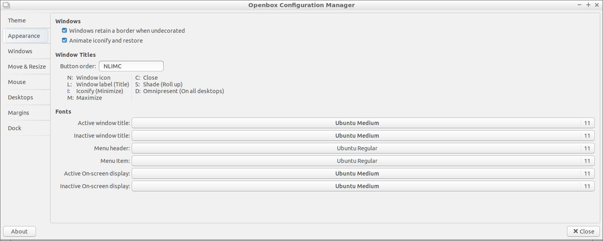

Chapter 4.2.1 Openbox Configuration Manager
===========================================

Descrption
----------
Openbox configuration manager applies customization to openbox the default window manager under the hood of LXDE. 
-Themes tab lets you change how the titlebar at the top of each window looks.
-Appearance Lets you change fonts of the titlebars and where the button to maximize or close a window. 
Mouse allows you to set that when you have your mouse over a window you immediately are focused on it without clicking. 
-Move and resize changes options with moving and resizing windows.
-Desktops lets you name your virtual desktops and change the number of them. 

Screenshot
----------

How to Launch
-------------
In the menu> prefrences> openbox configuration manager or run obconf from the command line. 
