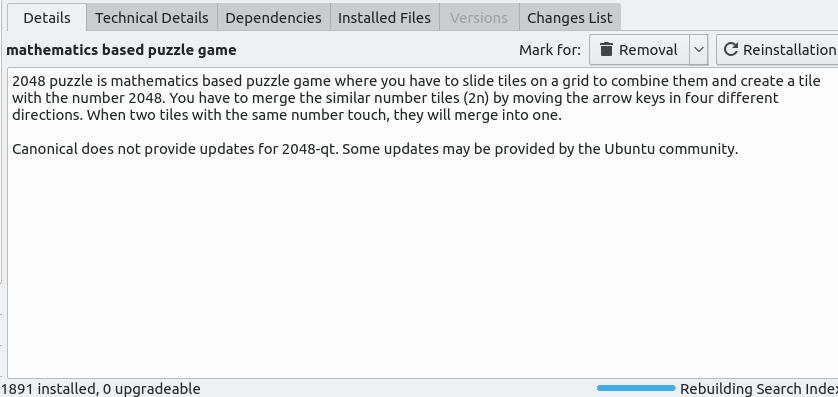
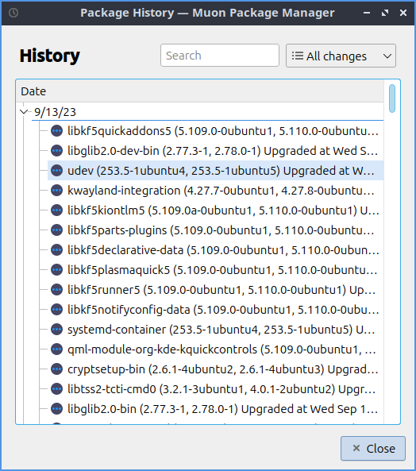
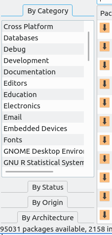
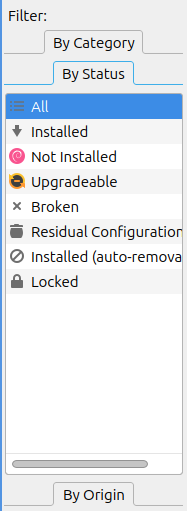
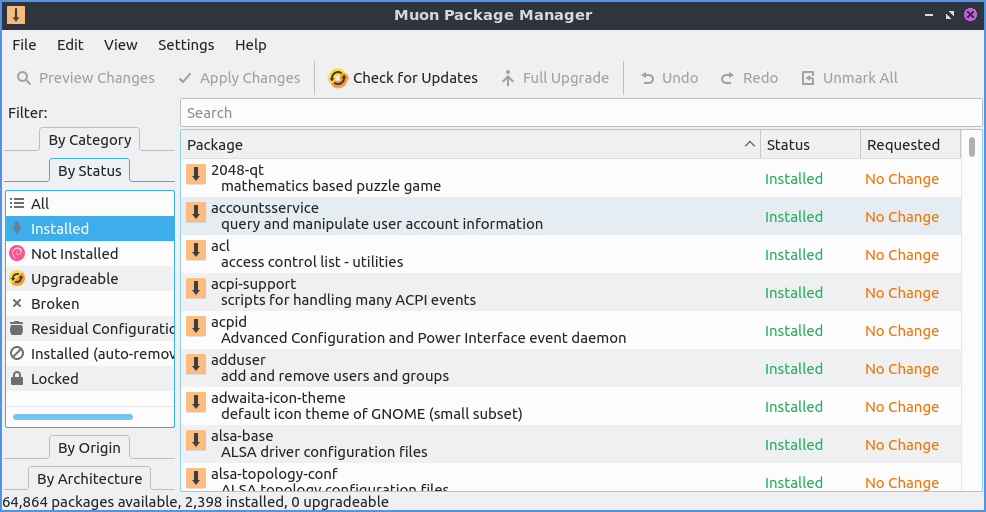
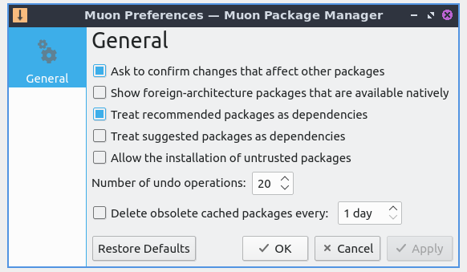
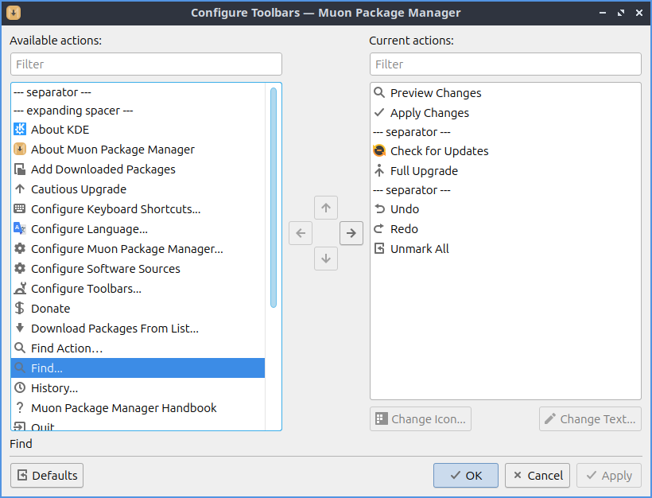
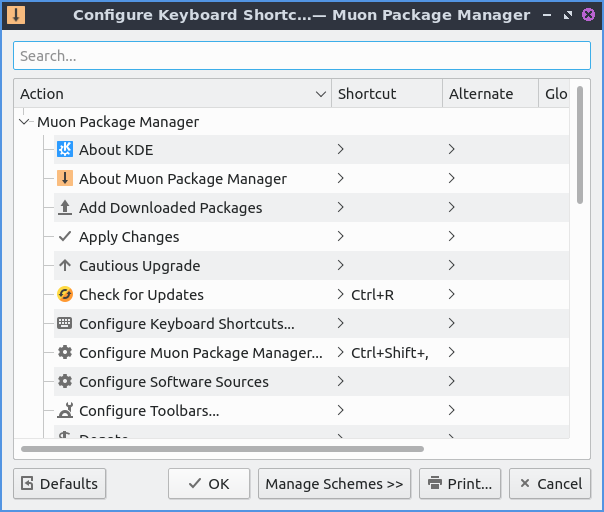

Chapter 4.2 Muon Package Manager
================================

Muon package manager is an alternative GUI for installing and updating updating packages. 

Usage
------
To update your packages press the gear button with a clockwise pointed arrow. If updates are available press the upward pointing arrow with a dot on top to install the updates. 

To search for a program to install type into the bar at the top that says :guilabel:`Search`. If you find something you want to install you can right click and then mark for installation. When the package you want to install has additional dependencies will show up if you think twice about wanting to install you can click the :guilabel:`Cancel` button to not pull in all those dependencies or press :guilabel:`OK` to continue looking for software to install. To apply your changes you can press the green checkbox button that says :guilabel:`Apply Changes` and you will end up entering your password to confirm you want to install and then the package will be installed. To go back to do other changes press the :guilabel:`Back` button. To preview your changes after hitting back press the :guilabel:`Preview Changes` button. If you want to undo the last operation you have done for installing packages press :kbd:`Control+z` or :menuselection:`Edit --> Undo`. To get rid of all your marked packages for installation :menuselection:`Edit --> Unmark All`. 

The :guilabel:`Package` shows the package name and a short description of the package. The :guilabel:`Status` shows what the current status of the package is. The :guilabel:`Requested` shows what status you want for the package. To reverse the sort order of packages press the triangle button just to the left of the :guilabel:`Status` column. 

To select the next package left click on the list of packages press the :kbd:`Down Arrow` key to move to the next selected package. To select the previous package left click on the list of packages above press the :kbd:`Up Arrow`.  

When you find your package you want to install on the bottom half of the screen there is a bar of tabs. The :guilabel:`Details` tab has a description of the package you are currently selected. The :guilabel:`Technical Details` will show you where the package comes from what category it is and what the installed size would be and what size it takes to download the package. The :guilabel:`Dependencies` tab shows you what other packages are needed by the package you wish to install. To view the changes of a package the :guilabel:`Changes List` and scroll down to view them. If you have installed a package you can see all files installed by that package in the :guilabel:`Installed Files` tab.

If you want to see your history of package updates and installed from the :menuselection:`View --> History` or press :kbd:`control + h`. To search through your history enter what you want to search for in the :guilabel:`Search` bar. To the right to the search is a drop down menu to choose whether to view :guilabel:`All changes`, :guilabel:`Installations`, :guilabel:`Updates`, or :guilabel:`Removals`. Under the :guilabel:`Date` field shows collapseable search results of the kind of packages you are looking for. To collapse or uncollapse a the operation on a particular date press the :guilabel:`+` button to uncollapse an operation on a date. To collapse operations on a particular date is to press the :guilabel:`-` button.

On the left hand side of Muon Package Manager there is a :guilabel:`By Category` divider. In this there are many different categories like :guilabel:`Graphics` and :guilabel:`Games and Amusement`. For example the graphics tab will have image editing or creating vector graphics in the :guilabel:`Graphics` category. To go back to seeing all packages select :guilabel:`All` under the :guilabel:`By Category` divider.

To view all installed packages on the left hand side of the window under filtered click the divider for :guilabel:`By Status` and select :guilabel:`Installed`. Now in the upper main part of the window will be a window with a scrollbar to see all packages on your system. To show only files that are not installed from the :guilabel:`By Status` divider select :guilabel:`Not Installed`. From the :guilabel:`By Status` divider select :guilabel:`Upgradeable` to see which packages can be upgraded. To see only packages that are broken the filter for :guilabel:`By Status` and select :guilabel:`Broken`. To view which packages that are not installed on your system but still have configuration file from the :guilabel:`By Status` divider select :guilabel:`Residual Configuration`. To view packages installed as a dependency and know can be removed from :guilabel:`By Status` and select :guilabel:`Install(auto-removable)`. To go back to seeing all packages in the :guilabel:`By Status` and select :guilabel:`All`.

To see which packages come from which source select either :guilabel:`By Status` and then select :guilabel:`Installed` or :guilabel:`All` to select all or installed packages. Then select :guilabel:`By Origin` and the name of any ppa will show which packages come from. To go back to seeing all packages select :guilabel:`All` on the sidebar under both :Guilabel:`By Status` and :guilabel:`By Origin`.

If you remove some packages you may have packages that were dependencies that are no longer needed anymore you can check on this by clicking the divider on the left hand side by :menuselection:`By Status --> Installed(auto-removeable)` will show if you have packages that are now able to be removed without any problems that are no longer serving a purpose. Then select the :guilabel:`Mark for Removal` button. If you just want to mark all packages for removal :menuselection:`Edit --> Remove Unnecessary Packages`. Then of course you will need to press the :guilabel:`Apply Changes` button to apply changes. 

To see what repository a package comes from on the left hand side use the :guilabel:`By Origin` filter on the left hand side. :guilabel:`Ubuntu` shows packages from the official Ubuntu repositories.

To see what architecture a package uses use the :guilabel:`By Architecture` filter. To see all architectures use the :guilabel:`All` line. To see common packages see the :guilabel:`Common` for packages common to all architectures. To see 64 bit packages use the :guilabel:`64-bit` line. To see 32 bit packages use the :guilabel:`32-bit` line.  

To check for updates in muon press :kbd:`Control + R` or the gear button with an arrow or :menuselection:`Edit --> Check for Updates`. To actually update and install these upgrades fully press the :guilabel:`Full Upgrade` button or :menuselection:`Edit --> Full Upgrade` and then press the :guilabel:`Apply Changes` button. After this a status bar towards the bottom will show how much total progress is on the upgrade. To have an upgrade where packages are not removed press the upward point arrow button or :menuselection:`Edit --> Cautious Upgrade`.

If you want to save all of your packages on a text file you can :menuselection:`File --> Save Package Download List`. If you want to load these packages from a file such as if you get a new laptop :menuselection:`File --> Download Packages From List`.  If you want to quit muon press :kbd:`Control+Q`.

On the bottom of muon package manager there is a toolbar that states how many packages are :guilabel:`available`, :guilabel:`installed`, and :guilabel:`upgradeable`.

To hide the toolbar uncheck the :menuselection:`Settings --> Show Toolbar` checkbox.

Screenshot
----------

Version
-------
Lubuntu ships with version 4:5.8.0 of muon package manager. 

How to Launch
-------------
To launch muon package manager from the menu :menuselection:`System Tools --> Muon Package Manager` or run 

.. code:: 

    muon 

from the command line. 

Customizing
-----------

To get to your preferences for Muon package manager :menuselection:`Settings --> Configure Muon Package Manager`. The checkbox :guilabel:`Ask To confirm changes that affect other packages` brings up confirmation dialog when you will affect multiple packages. The checkbox :guilabel:`Treat reccomended packages as dependencies` will always install all recommended packages as dependencies and will automatically install one when you install a recommended package. To always install suggested packages as dependencies check the :guilabel:`Treat Suggested packages as dependencies`. To change the maximum number of package operations you can undo change the :guilabel:`Number of undo operations` field. To save space by deleting old cached packages check the :guilabel:`Delete obsolete cached packages every` checkbox and change the field to the right to change how often to delete the cache. 

To change settings on your toolbar :menuselection:`Settings --> Configure Toolbars`. To remove an item from the current items on the toolbar press the button that is the leftward pointing arrow. To add an item to the toolbar press the button that is the rightward pointing arrow. To move an item up or down on the toolbar press the upward pointing arrow button. If you want to change the icon for things you have in your toolbar press the :guilabel:`Change Icon` button. To change what the toolbar says press the :guilabel:`Change Text` button and type what you want in the toolbar in the pop up menu.

 
To view and configure your shortcuts :menuselection:`Settings --> Configure Shortcuts` and a window to open shortcuts will appear. The column for :guilabel:`Action` says what the keyboard shortcut will do. The column  :guilabel:`Shortcut` will let you have a shortcut to apply changes. To add shortcut to something that does not have it press the small faint :menuselection:`-->` will bring a drop down menu and press the button next to the word :guilabel:`Custom` and input :kbd:`Your shortcut here`. 

