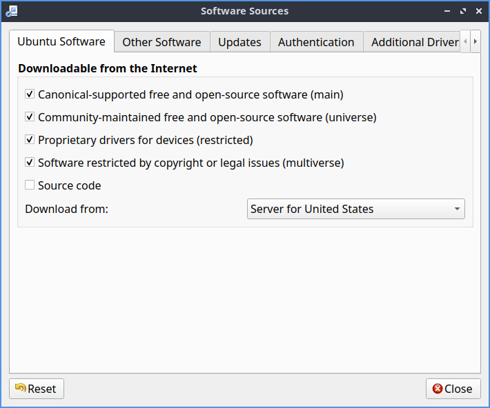
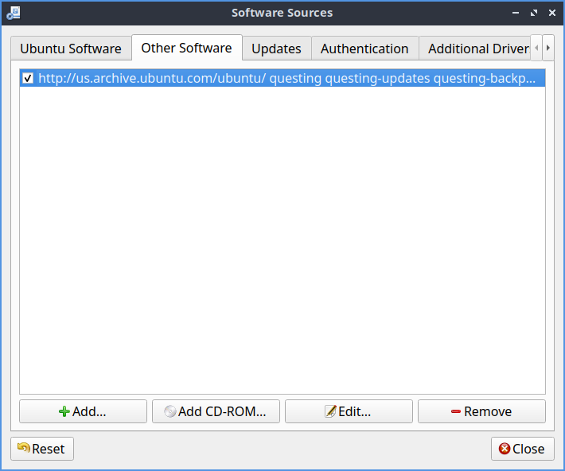
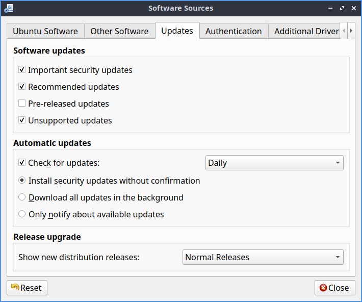
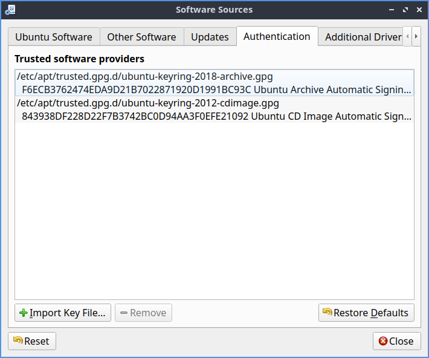

Chapter 4.2 Managing Software Sources
============================================

Occasionally you may need to change the setting of your software sources. This could involve: 

-   Changing update settings like update frequency, notification of new releases,
-   Adding or removing sources such as PPAs
-   Changing download server
-   Installing proprietary drivers

Usage
------

To use Software Sources you will need to authenticate with your password as this changes systemwide settings. You can navigate the Software Sources using the tabs at the top of the window.

The :guilabel:`Ubuntu Software` tab contains settings involving the downloading of software from Ubuntu repositories. Here you can disable proprietary software and select a download server among other things. To toggle enabling /disabling the proprietary drivers check/uncheck the :guilabel:`Proprietary drivers for devices(restricted)` checkbox. To toggle enabling/disabling other proprietary software check/uncheck the :guilabel:`Software restricted by copyright or legal issues(multiverse)` checkbox. To change the mirror or where you download change the :guilabel:`Download from` drop down menu. The :guilabel:`Main Server` option downloads from the main Ubuntu server. There is an :guilabel:`Other` option with a large list of mirrors. The :guilabel:`Mirror` column lists a collapse list of mirrors to download from. To choose the fastest option press the :guilabel:`Select Best Server`. To see what protocol you will use to download packages from this mirror see the :guilabel:`Protocol` field.

The :guilabel:`Other software` tab allows you to add, remove, or edit other software sources. Here you can manage remote repositories (PPAs) and CD-ROM repositories. To enable/disable a software source click the checkbox to the left of its name. To remove software from the list left click the :guilabel:`Remove` button. To add a third party source of software to your system press the :guilabel:`Add` button. 

To change where a source is downloading software from press the :guilabel:`Edit` button. To change between downloading source and binary code use the :guilabel:`Type` menu. To change where the link to download software change the :guilabel:`URI` field. To change what distribution this source is for enter that in the :guilabel:`Distribution` field. To change what parts of the repository to use the :guilabel:`Components` field. To add a comment to yourself about a repository enter it in the :guilabel:`Comment` field.

The :guilabel:`Updates` tab allows you set which software updates you would like to subscribe to, in this case :guilabel:`Important security updates`, :guilabel:`Recommended updates`, :guilabel:`Pre-released updates` , and :guilabel:`Unsupported updates`. You can also set how frequently your system will automatically check for updates to the right of :guilabel:`Check for updates` and then select how often of :menuselection:`Daily`, :menuselection:`Every Two days`, :menuselection:`Weekly`, or :menuselection:`Every two weeks`. To not check for updates uncheck the :guilabel:`Check for updates` checkbox. To automatically install security updates press the :guilabel:`Install security updates without confirmation` button. To only notify about updates press the :guilabel:`Only notify about available updates` button. To start downloading all updates in the background press the :guilabel:`Download all updates in the background` button. You can also specify which releases you would like to be notified of in the :guilabel:`Show new distribution releases` drop down, :menuselection:`Normal Releases`, :menuselection:`Long term releases only`, or :menuselection:`Never`.

The :guilabel:`Authentication` tab manages key files which ensure your downloads are not compromised, basically ensuring you are download from a reliable source and your download has not been intercepted. The list of all keys signed on your system are listed under :guilabel:`Trusted software providers`. To remove a key you no longer want to have access to your system press the :guilabel:`Remove` button. To only allow the default keys that ship with Lubuntu press the :guilabel:`Restore Defaults` button.

Submitting statistical data will improve the Ubuntu experience allowing developers to know which software you are downloading anonymously. We urge you to enable this feature but it is disabled by default as Lubuntu has an "Opt-in" philosophy.

To reset changes to software sources press the :guilabel:`Reset` button. If you made changes and close software sources a dialog stating :guilabel:`Your local copy of the software catalog is out of date` and so press the :guilabel:`Reload` button to download a list of packages now from the new sources. 

Proprietary Drivers
-------------------
To install proprietary drivers use the :guilabel:`Additional Drivers` tab. Then press the check box to use the :guilabel:`Using Driver Name` radio button to input the proprietary driver for that checkbox. To not use proprietary drivers for something press the :guilabel:`Do not use the device` radio button. To apply these changes you will need internet access and will need to press the :guilabel:`Apply Changes` button. To revert back to your previous changes press the :guilabel:`Revert` button. 

To launch this part of the program directly :menuselection:`Preferences --> Additional Drivers` with the icon that looks like a circuit board with pins on thee bottom.

.. image:: proprietary-drivers.png

Version
-------
Lubuntu ships with version 0.99.44 of Software Sources. 

How to Launch
-------------

To launch software properties from the menu you can :menuselection:`Preferences --> Software Sources`. In Muon Package Manager :menuselection:`Settings --> Configure Software Sources`. In Discover Software Center :menuselection:`Settings --> Ubuntu (Default) --> Settings (Gear icon) --> Software Sources`. From the command line run 

.. code:: 

    lxqt-sudo software-properties-qt
    
The icon for Software Sources looks like a dark circle with three blue dots.

tags:PPA, software, download, sources, release, update, Discover, Muon, security, 
