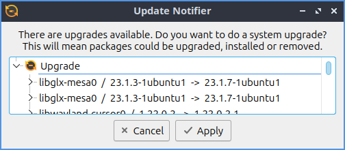

Chapter 4.3 Lubuntu Update
===========================

Lubuntu Update is a simple program to upgrade your system.

Usage
-----
To install an updates left click on the :guilabel:`Install Updates` button. Then a authentication dialog will need you to enter your password. After authenticating a progress bar and a terminal output on the bottom will appear. When the update is done on top will say :guilabel:`Update installation complete`.

On top of the window shows the total number of pacakages under :guilabel:`x package(s) will be updated`. To the right you get how many are security updates on :guilabel:`of these aupdates are security related`. To see what new packages will be installed look under :guilabel:`To be installed`. To see what packages will be updated click on the :guilabel:`To be upgraded` section. To see what will be removed read under :guilabel:`To be removed`. To see what packages will be held back check under :guilabel:`Held Back`.

To see what will change on a update left click on the a category most likely :guilabel:`Upgrade` and see what list of packages will be upgraded. If there are any security updates a second column will appear that says :guilabel:`Security`. Next to each security update a green shield will show up to denote that upgrade is a security upgrade. To see further what dependencies are pulling in the upgrade and to collapse them click the arrow next to the package to be upgraded and again to collapse the list.

If updates are needed an icon will show up in the system tray with the lubuntu logo and left click it to bring up updates.

If you have to restart after an update the window will say :guilabel:`Restart Required`.

Screenshot
----------

Version
-------
Lubuntu ships with version 1.0.0 of Lubuntu Update.

How to Launch
-------------
To launch Update Notifier :menuselection:`Preferences --> Lubuntu Update`, press the :guilabel:`Lubuntu Update` from LXQt Configuration Center, left click the tray icon, or from the command line run

.. code::

    lubuntu-update

The icon for Lubuntu Update looks like a goldenrod circle with two circular arrows around the circle.
