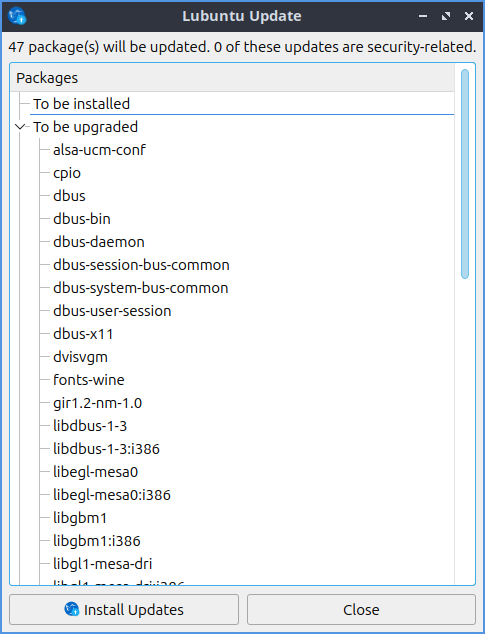

Chapter 4.3 Lubuntu Update
===========================

Update Notifier is a simple program to upgrade your system.

Usage
-----
To apply an upgrade for the press the :guilabel:`Upgrade` button. This will bring up a prompt for Update Notifier with lxqt-sudo for you to authenticate applying updates. After this happens in the center will be a large progress bar showing the progress of installing. Press the :guilabel:`OK` button after entering your password. Once the update is done press the :guilabel:`Close` button.

To see what will change on a update left click on the a category most likely :guilabel:`Upgrade` and see what list of packages will be upgraded. If there are any security updates a second column will appear that says :guilabel:`Security`. Next to each security update a green shield will show up to denote that upgrade is a security upgrade. To see further what dependencies are pulling in the upgrade and to collapse them click the arrow next to the package to be upgraded and again to collapse the list.

If you have to restart after an update the window will say :guilabel:`Restart Required`.

Screenshot
----------

Version
-------
Lubuntu ships with version 1.0.0 of Lubuntu Update.

How to Launch
-------------
To launch Update Notifier :menuselection:`Preferences --> Lubuntu Update`, press the :guilabel:`Lubuntu Update` from LXQt Configuration Center, or from the command line run

.. code::

    lubuntu-update

The icon for Update Notifier looks like a goldenrod circle with two circular arrows around the circle.
