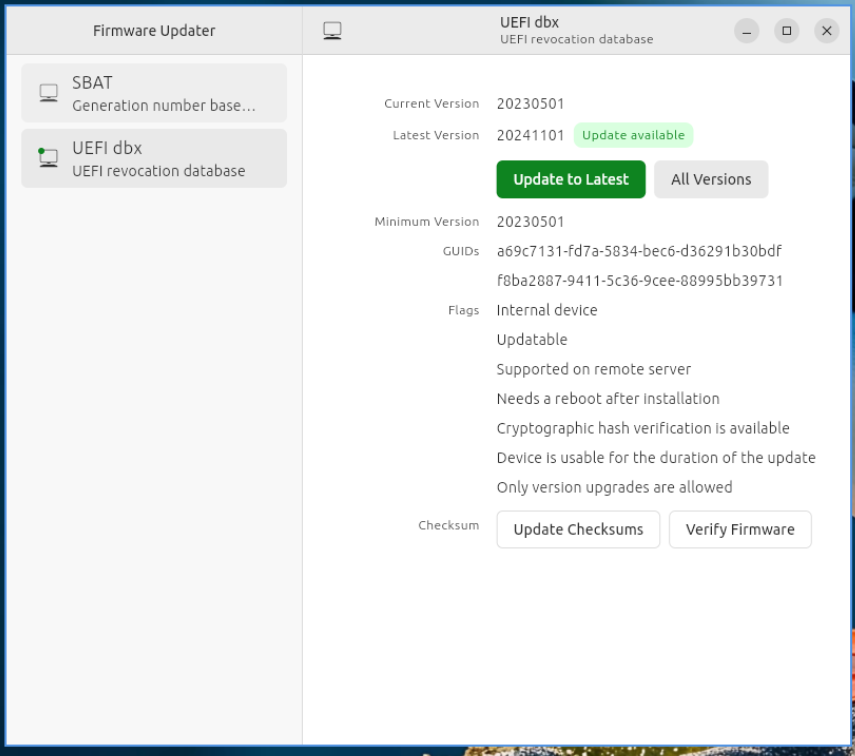

Chapter 4.4 Firmware Updater
============================
Firmware Updater updates the firmware on your machine.

Usage
-----
The left column of Firmware Updater shows which different devices have firmware that can be updated. To switch to a different device simply left click on it. To see the version of software that needs to be upgraded read the :guilabel:`Current Version` label. To see the vendor for your firmware view the :guilabel:`Vendor` field. To see flags about what happens when you have a update read the :guilabel:`Flags` field.

If nothing of your hardware can be found to be updated Firmware updater will say :guilabel:`No devices found`. To switch between multiple devices to update firmware left click on the list of devices on the column on the left hand side. The device you are currently looking at has what device on the top of the right hand column. 

To actually update left click on the :guilabel:`Update to latest` button. Then confirm your update by left clicking the :guilabel:`Update` button. If your device needs to restart to update firmware you will get a restart now or later dialog. To restart now left click the :guilabel:`Restart now` button. To choose a later time to restart left click the :guilabel:`Restart later` button.

Version
-------
Lubuntu ships with version 167 of firmware updater.

How To launch
-------------
To launch Firmware Updater :menuselection:`System Tools --> Firmware Updater` or run 

.. code:: 

   firmware-updater
   
   
from the command line.
