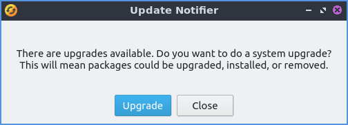

Chapter 4.4 Update Notifier
===========================

Update Notifier is a simple program to upgrade your system.

Usage
-----
To apply an upgrade for the press the :guilabel:`Upgrade` button. This will bring up a prompt for Update Notifier with lxqt-sudo for you to authenticate applying updates. After this happens in the center will be a large progress bar showing the progress of installing. Press the :guilabel:`OK` button after entering your password. Once the update is done press the :guilabel:`Close` button.

If you have to restart after an update the window will say :guilabel:`Restart Required`.

Screenshot
----------

Version
-------
Lubuntu ships with version 0.1 of Update Notifier.

How to Launch
-------------
To launch Update Notifier :menuselection:`Preferences --> Apply Full Upgrade` or from the command line run

.. code::

    lubuntu-upgrader

The icon for Update Notifier looks like a yellow circle with two circular arrows above it.
