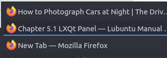
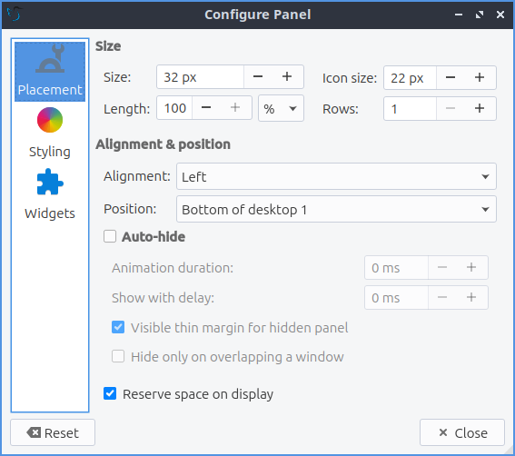
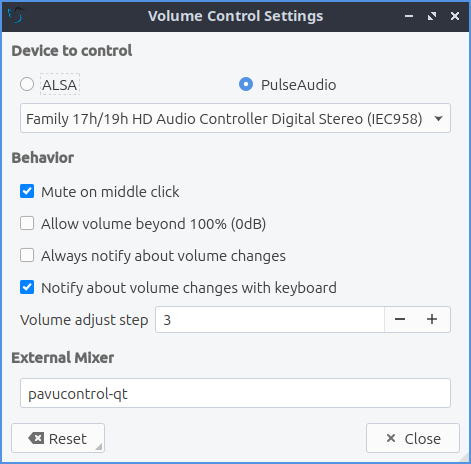

Chapter 5.1 LXQt Panel
======================
LXQt Panel is the bar situated at the bottom of your screen by default. The panel contains an application menu, a desktop switcher, a quicklaunch bar, a taskbar, a system tray containing applets, and a clock. The panel is highly configurable with a number of settings and plugins.

Usage
------

The application menu allows you to browse and search through available programs; a keyboard shortcut is conveniently available for this and is set to :kbd:`Super(Windows)` by default. The menu has many subcategories to launch each application. The :menuselection:`Leave` menu has options to :menuselection:`Hibernate`, :menuselection:`Leave`, :menuselection:`Logout`, :menuselection:`Reboot`, :menuselection:`Shutdown`, or :menuselection:`Suspend`. If you want to lock your screen select :menuselection:`Lock Screen`. If you mouseover a program you can see a description of that program in the menu. To go back one level or close the root level of the menu press the :kbd:`Escape` key. The desktop switcher allows you to switch to another virtual desktop, allowing you to keep your workspace organized by left clicking on the desktop number or using the mousewheel to change desktops. To see your desktop names simply mouseover the desktop number to see the desktop name.

.. image:: menu_search.png

The quick launch bar allows you to conveniently launch your file manager (PCManFM) and web browser (Firefox) by left clicking on the program. If you right click on the icons in quick launch on something like Firefox will have items for each program. To add a program to quick launch open the menu and find it there and drag it down onto the panel. To remove an item from quick launch right click on the icon and select :menuselection:`Remove from quicklaunch`. To move an item on your quick launch to the left right click the icon and select :menuselection:`Move left`. To move an item to the left right click the icon and select :menuselection:`Move right`. To show your desktop press the show desktop button between the quick launch and the taskbar. 

The taskbar lists the windows you currently have open. To bring one of these windows to focus simply left click the windows on the task bar. If you have multiple of the same window left clicking will open the group, allowing you to select between the different windows by left clicking. If you want to close a group of multiple windows you can right click the group and click :menuselection:`Close group`. To see a list of all the windows in a group mouseover the group of windows on the taskbar.

On a single window to move it to a different desktop right click to desktop to move the desired desktop. The item to current desktop moves the window to your current virtual desktop. Right clicking and selecting :guilabel:`Move` lets you drag the application around to the desired point on the desktop. The resize option from the same window lets you resize the window you right clicked on. Right click and select :menuselection:`Maximize` on a window to maximize it. Right clicking on window :menuselection:`Restore` will have a window back to its original size. If you right click :menuselection:`Minimize` on the window will minimize your window. Right clicking :menuselection:`Roll up` on a window will make the window only your titlebar. Right clicking :menuselection:`Layer` will allow you to have move a window :menuselection:`Always on top`, :menuselection:`Normal`, and :menuselection:`Always on bottom`. Finally to close a window with right click on the taskbar and select :menuselection:`Close` will close the window. If you middle click on an item in the taskbar you will close the window. If you try to close a program that is not responding you will be asked if you want to end the task. To move items around on the taskbar into a particular order left click on them and drag them to the desired position. To minimize a different window from the task bar you can minimize by moving the mousewheel down. If you want to move a program around on the taskbar left click on it and drag it to the desired location.

.. image:: menu-right-click.png

The removable media applet will allow you to manage your remove flash drives and external hard drives and to unmount them without data loss on your system. To unmount such devices left click on the panel that looks like a disk and then click the eject button that is an upward pointing arrow.  To open your removable media click on the removable media applet left click on the removable media to open the external media in your file manager. To view your docked notifications away from keyboard press the button that looks like an exclamation on a chat bubble. To clear these notifications left click the docked notifications and press :menuselection:`Clear All`.

.. image:: system_tray.png

In the system tray there there are multiple widgets. With the volume applet you can change the volume by using the mouse-wheel with the mouse over the speaker icon or left click the speaker icon and drag the volume up and down. To mute the volume with the button at the bottom of the volume meter or middle click on the volume applet. 

.. image:: volume-widget.png

To the far right is a clock, you can left click the clock to bring up a pop up calendar window. To go to the next month on the calendar press the rightward pointing arrow. To go the previous month on the calendar press the leftward pointing arrow. Another way to change months on the calendar is to use the mousewheel. To change the month on a calendar to list all months in the year left click on the month and then select the month you want from your menu. To change the year on your claendar left click on the year in the clanedar and then use the up and down arrows or the mouse wheel to select the year.

.. image:: calendar-widget.png

If you are on a laptop the panel will also show the battery meter to show how much power you have remaining. To view your current charge level mouseover the battery meter and it will show if your battery is charging by mousing over. To view information about your battery left click the battery icon. The field :guilabel:`Energy Full Design` shows how much power your battery held when it was brand new. The field :guilabel:`Energy Full` shows the current full charge of your battery in your current health.The :guilabel:`Energy Now` shows how much power is in your battery. The :guilabel:`Technology` field shows what kind of battery you have.

.. image:: panel-battery.png
 
As mentioned below, the panel is highly configurable and you can customize it by right clicking at various places. If you do not want to mess up your panel right click on the panel and select :menuselection:`Lock This Panel` and do the same again to unlock your panel. 

Customizing
-----------
To change many panel settings right click not on the main taskbar and select :menuselection:`Configure Panel`. To close each of these windows you open by right clicking press the :kbd:`Escape` key.

The :guilabel:`Panel` tab has settings for the color and position of the panel. To move the panel there is a drop down menu of position that can move it to the side of the screen you want. The :guilabel:`Alignment` drop down menu lets you set the alignment of the panel on your screen. Keep in mind changing the alignment will not change anything if your panel takes the entire screen. To change the position of your panel use the :guilabel:`Position` field to move the panel on your screen around. If you have multiple monitors the :guilabel:`Position` field will have different options for moving the panel onto different monitors. The :guilabel:`Size` menu lets you increase or decrease the width of the panel. :guilabel:`Length` has two fields the one is either :menuselection:`px` or :menuselection:`%` is for to change the length of the panel in pixels while  percent is a percent of the entire screen size that changes if you change resolution. The first is the number of pixels or percent of the screen you want the panel to cover. The :guilabel:`Icon size` makes the size of the icons bigger or smaller on the panel. If you want multiple rows in your system tray and taskbar make the :guilabel:`Rows` field. 

If you want to autohide the panel check the :guilabel:`Auto-hide` checkbox in panel settings. To change how long the animation takes to show or hide the panel change the :guilabel:`Antimation duration` field. To show how long your panel will appear when it comes back after hiding in miliseconds change the :guilabel:`Show with delay` field. To show a very thin bit of the panel visible when autohidden check the :guilabel:`Visible thin margin for hidden panel` checkbox. To have the space for the panel not be used for anything else check the :guilabel:`Reserve space on display` checkbox.

To change to a custom font color press the :guilabel:`color button` checkbox. Press the dropper button to bring up a widget to choose the custom color. The checkbox for :guilabel:`background color` sets a background color custom for the background of lxqt-panel and the :guilabel:`dropper` brings up how to select which color. To add an image to your panel background press the checkbox and select your image for the file in the dialog.

The checkbox for :guilabel:`Override icon theme` lets you choose a non system default icon theme for lxqt-panel. The dropdown  :guilabel:`Icon theme for panels` lets you see what that icon theme from the dropdown list. If you do not like your changes to the system you can press the :guilabel:`Reset` button to reset changing to before trying to customize the panel. 

The :guilabel:`Widgets` lets you change the widgets or individual items on the panel and their configuration. You can also get to this directly by right clicking on the panel and select :menuselection:`Manage Widgets`. To move an applet down on the order of presentation press the down arrow button while the up arrow button moves the applet up on the order of presentation. To add a new widget click on the widget on the panel configuration screen and press the :guilabel:`+`  button and select the widget you want to add some of which are not on the panel by default. To remove an applet you do not want you can press the :guilabel:`-` button. The gear button has the settings for certain but not all of the applets in the panel for example the application menu and task manager are customizable but quick launch and show desktop do not.  

Shipped applets not enabled by default:
 - CPU Monitor
 - Color Picker
 - Panel Dom Tree
 - Sensors
 - System Statistics
 - Spacer

.. image:: panel-config-widgets.png

To configure options for your application menu right click on the menu configure application menu or from the panel configuration dialog with the widget selected for application menu click on the gear button. The checkbox for :guilabel:`Icon` lets you choose a custom icon to use in your menu if you want one and then use the folder button to browse for the path of the custom file you want for your menu. The checkbox for :guilabel:`Button text` lets you add text that can be anything you want to your menu.  To change your own font size check the :guilabel:`Custom font size` checkbox and choose your font size on the field to the right. To change the shortcut to open the menu from the default :kbd:`Left Super (Windows)` you can press the button for keyboard shortcut and a countdown will begin a countdown and press the button. To set a custom keyboard shortcut to open the menu left click on :guilabel:`Click the button to record shortcut` button then press the keyboard shortcut you want. 

To turn off searching in the menu uncheck the :guilabel:`Filter menu entries` and :guilabel:`Show matching entries checkbox`. Leave both of these checked to allow searching. To set the most number of search results in the menu change the :guilabel:`Maximum visible items` field. To change how wide each search result can be change the :guilabel:`Max. item width` field. To not hide what section of the menu everyone has :guilabel:`Hide menu entries while searching` checkbox. To not clear your search upon opening the menu again uncheck the :guilabel:`Clear search upon showing menu` checkbox.

.. image:: menu-pref.png 

To customize the desktop switcher right click on the desktop switcher :menuselection:`Configure Desktop Switcher` or press the :guilabel:`Gear` button. To change the number of rows on your desktop change the :guilabel:`Number of rows` field. To change how desktops are labeled change the :guilabel:`Desktop Labels` field. To change the name of each desktop enter a name under :guilabel:`Desktop Names`. 

.. image:: desktop-switch.png 

To move an item in quick launch to the right right click on the icon and select :menuselection:`Move right` on the menu. To move an item in quick launch to the left right click on the icon and select :menuselection:`Move left`. To remove an item from quicklaunch right click on the icon :menuselection:`Remove from quicklaunch`. To add an item to quick launch drag it down from the main menu.

To change options for your task manager or taskbar open the panel configuration dialog select taskmanager taskbar and click the gear button. The checkbox for :guilabel:`Show only windows from desktop` will only show windows from a certain desktop and will have a drop down that will default to the current desktop but can also be shown. To hide windows on a different screen check the :guilabel:`Show only windows from panel's screen` checkbox. To have the taskbar only show minimized windows check the :guilabel:`Show only minimized windows`. To raise minimized windows on your current desktop check the :guilabel:`Raise minimized windows on current desktop` checkbox. To close windows on a middle click check the  checkbox :guilabel:`Close on middle-click`. To cycle windows by scrolling with the mousewheel check the :guilabel:`Cycle windows on wheel scrolling` checkbox. The :guilabel:`Window grouping` checkbox will group multiple windows of the same program into a group of windows. The checkbox for :guilabel:`Show popup on mouse hover` will allow you to hover the mouse over the window group to show them off. 

.. image:: taskmanager-config.png

To change the look of your taskbar in the same window as above the appearance section the :guilabel:`Button style` menu will change whether to show only the icon or the icon only for only the icons. To show window and the text label of the program  :guilabel:`Icon and text`. :guilabel:`Icons only` will work best with a panel aligned to the left or right side of your screen. To have only the text on your taskbar and no icons select :guilabel:`Only text`. To change the maximum width of a button change the :guilabel:`Maximum button width` which is measured in pixels to how wide on maximum a button could be. To change how high a button will be when a panel is vertical change the :guilabel:`Maximum button height` field. If you want to reset your changes to this window press the :guilabel:`Reset` button.

The settings for removable media is able to be opened up is right click the applet :menuselection:`Configure "Removable media"` you can select :menuselection:`Show info`, :menuselection:`Popup menu`, or :menuselection:`Do nothing`. If you want to reset the setting for this press the :guilabel:`Reset` button. 

To configure the volume applet right click on the volume applet and select :menuselection:`Configure "Volume Control"`. To change which audio output to have the applet control change the dropdown at the bottom of the :guilabel:`Device to control` box.  To toggle muting on middle clicking check the :guilabel:`Mute on middle click` checkbox. To toggle having to click to bring up the volume applet check the :guilabel:`Show on mouse click` checkbox. To allow your volume in software to be over 100 percent check the :guilabel:`Allow volume beyond 100%` checkbox. To always show notification on volume changes check the :guilabel:`Always notify about volume changes` checkbox. To change how sensitive your volume meter is change the :guilabel:`Volume adjust step`. To change what you use as your mixer type the command in the :guilabel:`External Mixer` field.

To change the settings on your clock right click on the clock and then configure world clock. The format drop down menu allows you to change how the clock shows. To select a short format allows you to have a preselected short format which shows a 12 hour format and am just telling you what time it is. Selecting long from the menu will show you the time with seconds and the time zone. To have a customizable clock message select custom and then checkboxes to show seconds, pad the hours with zeros or to use a 12 hour format. The :guilabel:`Time zone` checkbox will show your your time zone. The :guilabel:`Position` drop down  says where to put the time zone on the clock. The :guilabel:`Format` field changes how the time zone is displayed on your clock.  To change how the date appears change the :guilabel:`Format` field.  

.. image::  clock-custom.png 

To show the date on the clock check the :guilabel:`Date` checkbox. To change where the date appears on the clock change the :guilabel:`Position` drop down menu.To further customize your panel select :menuselection:`Custom` from the :guilabel:`Format` drop down. To show the year press the :guilabel:`Show year` checkbox. To show what day of the week it is check the :guilabel:`Show day of week` checkbox. To make the day two digits check the :guilabel:`Pad day with zero` checkbox. To not abbreviate the months and days of week check the :guilabel:`Long month and day of week names` checkbox. To reset your changes to the time and date press the :guilabel:`Reset` button.

To add a second panel right click on the panel and :menuselection:`Add New Panel` and a new panel will be created with the dialog to customize your second panel. To remove a panel right click on the panel and select :menuselection:`Remove Panel` and you will be asked if you really want to do this as it can't be undone. To then make your panel useful you will need to add widgets which you will need to see the above section.

Non-Default widgets
-------------------

To have a bar that shows CPU Load shows a bar graph with your CPU usage. To bring up settings for your CPU usage is right click on the CPU bar :menuselection:`Configure CPU Monitor`. The :guilabel:`Show text` checkbox shows a number for CPU usage. The field for :guilabel:`Update interval` is how often to update your CPU usage. The :guilabel:`Bar orientation` says what side to start the bar graph. The :guilabel:`Bar width` is how wide to make the bar graph. If you want to reset your changes press the :guilabel:`Reset` button.

.. image::  CPU-load-settings.png

The Color picker is shows what color something is on your screen usually useful for web developers. To get a color off the screen press the color dropper button and your mouse will turn into crosshair and then left click on what you want to take the color. Then a numeric field to the right of the dropper will appear with the color in a numeric field to the right. 

.. image::   spacer-color-picker.png

To use your sensors widgets which you would have to add manually as shown above. A sensor bar will appear with as many sensors as on your panel. To view the temp as a number mouse over the sensor bar to see what your temperature is in a number. 

To customize the sensors right click on the sensors applet :menuselection:`Configure "Sensors"`. The :guilabel:`Update interval(seconds)` field lets you choose how often in seconds to update the sensors. The :guilabel:`Temperature bar width` field shows how wide to make the bar for your sensors. The :guilabel:`Temperature scale` field lets you select :guilabel:`Celsius` or :guilabel:`Fahrenheit` for your sensors. The checkbox :guilabel:`Warning about high temperature` puts a warning if your temperature gets too high. The :guilabel:`Crit` field shows the temperature your CPU should not reach. If you want to reset your settings press the :guilabel:`Reset` button. 

The :guilabel:`Sensors` tab provides settings for each individual sensor on your processor. To enable/disable which sensor press to the :guilabel:`Enabled` checkbox for each sensor. The :guilabel:`Label` shows a label for each sensor. The :guilabel:`Color` column shows the color for the bar to appear in the panel and you can bring up a dialog to change color by left clicking on the button. To switch to a different chip to set the sensors for change the :guilabel:`Detected chips` menu. 

.. image::   sensors-applet.png

To add a spacer to your panel add the spacer widget. It creates a blank space on your panel. To change how wide your spacer is change the :guilabel:`Space Width` field to the number of pixels you want the spacer to be wide. The setting for :guilabel:`Space type` selects a solid line, a dotted line, or invisible for how the spacer appears on the panel.

Version
-------
Lubuntu ships with version 0.13.0 of lxqt-panel.

How to launch
-------------
lxqt-panel should auto launch by default. If you need to manually start it, run

.. code:: 

    lxqt-panel 
    
from the command line.
