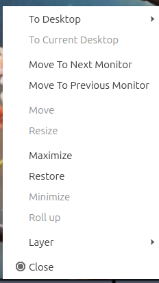

Chapter 5.1 LXQt Panel
======================
LXQt Panel is the bar situated at the bottom of your screen by default. The panel contains an application menu, a desktop switcher, a quick-launch bar, a taskbar, a system tray containing applets, and a clock. The panel is highly configurable with a number of settings and plugins.

Usage
------

The application menu allows you to browse and search through available programs; a keyboard shortcut is conveniently available for this and is set to :kbd:`Alt +F1` by default. The menu has many subcategories to launch each application. The leave menu has how to Hibernate, Leave, Logout, Reboot, Shutdown, or Suspend. If you mouseover a program you can see a description of that program in the menu. The desktop switcher allows you to switch to another virtual desktop, allowing you to keep your workspace organized. The quick launch bar allows you to conveniently launch your file manager (PCManFM) and web browser (Firefox). To add a program to quick launch open the menu and find it there and drag it down onto the panel. 

.. image:: menu_search.png

The taskbar lists the windows you currently have open. To bring one of these windows to focus simply left click the windows on the task bar. If you have multiple of the same window left clicking will open the group, allowing you to select between the different windows. If you want to close a group of multiple windows you can right click the group and click close all. 

.. image:: multiple_tasks.png

On a single window to move it to a different desktop right click to desktop to move the desired desktop. The item to current desktop moves the window to your current virtual desktop. Right clicking move lets you drag the application around to the desired point on the desktop. The resize option from the same window lets you resize the window you right clicked on. Right click and then select maximize on a window to maximize it. Right clicking on window Restore will have a window back to its orginal size. If you right click minimize on the window will minimize your window. Right clicking roll up on a window will make the window only your titlebar. Right clicking to layer will allow you to have move a window always on top, normal, and always on bottom. Finally to close a window with right click on the taskbar and select close will close the window. If you middle click on an item in the taksbar you will close the window.   

The removeable media applet will allow you to manage your remove flash drives and external hard drives and to unmount them without data loss on your system. To unmount such devices left click on the panel that looks like a disk and then click the eject button that is an upward pointing arrow. 

In the system tray there there are multiple widgets. With the volume applet you can change the volume by using the mouse-wheel with the mouse over the speaker icon left click the speaker icon and drag the volume up and down and toggle mute with the button at the bottom or middle click on the volume applet.  To the far right is a clock, you can click the clock to bring up a pop up calendar window.  

.. image:: system_tray.png

As mentioned before, the panel is highly configurable and you can customize it by right clicking at various places.

Customizing
-----------
To change many panel settings right click not on the main taskbar and click the  gear button for panel settings.  

The :guilabel:`Panel` tab has settings for the color and position of the panel. To move the panel their is a drop down menu of position that can move it to the side of the screen you want. The :guilabel:`alignment` drop down menu lets you set the alignment of the panel on your screen if you choose to move it or make it only a portion of the screen. The :guilabel:`size` menu lets you increase or decrease the width of the panel. :guilabel:`Length` has two fields the one is either px or percent is for to change the length of the panel in pixels while  percent is a percent of the entire screen size that changes if you change resolution. The first is the number of pixels or percent of the screen you want the panel to cover. The icon size makes the size of the icons bigger or smaller on the panel. 

If you want to autohide the panel check the :guilabel:`Auto-hide` checkbox in panel settings. To show how long your panel will appear when it comes back after hiding in miliseconds.  

.. image:: lxqt-panel-config.png 

The :guilabel:`Widgets` lets you change the widgets or individual items on the panel and their configuration. To change to a custom font color press the :guilabel:`color button` checkbox. Press the dropper button to bring up a widget to choose the custom color. The checkbox for :guilabel:`background color` sets a background color custom for the background of lxqt-panel and the :guilabel:`dropper` brings up how to select which color. To add an image to your panel background press the checkbox and select your image for the file in the dialog.  

The checkbox for :guilabel:`override icon theme` lets you choose a non system default icon theme for lxqt-panel. The dropdown then lets you see what that icon theme from the dropdown list. If you do not like your changes to the system you can press the reset button to reset changing to before trying to customize the panel. 

To add a new widget click on the widget on the panel configuration screen and press the :guilabel:`+`  button and select the widget you want to add some of which are not on the panel by default. To move an applet down on the order of presentation press the down arrow while the up arrow moves the applet up on the order of presentation. To remove an applet you do not want you can press the :guilabel:`-` button. The gear button has the settings for certain but not all of the applets in the panel for example the application menu and task manager are customizeable but quick launch and show desktop do not.  

Shipped applets not enabled by default:
 - Cpu Monitor
 - Color Picker
 - Panel Dom Tree
 - Sensors
 - System Statisitics
 - Spacer

.. image:: panel-config-widgets.png

To configure options for your application menu right click on the menu configure application menu or from the panel configuration dialog with the widget selected for application menu click on the gear button. The checkbox for :guilabel:`icon` lets you choose a custom icon to use in your menu if you want one and then use the folder button to browse for the path of the custom file you want for your menu. The checkbox for :guilabel:`menu text` lets you add text that can be anything you want to your menu. To change the shortcut to open the menu from the default :kbd:`Alt + f1` you can press the button for keyboard shortcut and a countdown will begin a countdown and press the button.

To move a an item in quick launch to the right right click on the icon and select move right on the menu. To move an item in quick launch to the left right click on the icon and select move left. To remove an item from quicklaunch right click on the icon Remove from quicklaunch. To add an item to quick launch drag it down from the main menu.

To change options for your task manager or taskbar open the panel configuration dialog select taskmanager taskbar and click the gear button. The checkbox for :guilabel:`show only windows from desktop` will only show windows from a certain desktop and will have a drop down that will default to the current desktop but can also be shown. To have the taskbar only show minimized windows check the :guilabel:`Show only minimized windows`. To close windows on a middle click check the  checkbox :guilabel:`Close on middle click`. To cycle windows by scrolling with the mousewheel check the :guilabel:`Cycle windows on wheel scrolling` checkbox. The :guilabel:`window grouping` checkbox will group multiple windows of the same program into a group of windows. The checkbox for :guilabel:`show popup on mouse hover` will allow you to hover the mouse over the window group to show them off. 

To change the look of your taskbar in the same window as above the appearance section the :guilabel:`button style` menu will change whetehre to show only the icon or the icon only for only the icons. To show window and the text label of the program  :guilabel:`text and icon`. :guilabel:`Icons only` will work best with a panel aligned to the left or right side of your screen. To have only the text on your taskbar and no icons slecet :guilabel:`only text`. To change the maximum width of a button change the :guilabel:`maximum button width` which is measured in pixels to how wide on maximum a button could be. To change how high a button will be when a panel is vertical change the :guilabel:`Maximum button height` field. 

The settings for removeable media is able to be opened up is right click the applet Configure Removeable media you can select show info, popup menu, or do nothing. If you want to reset the setting for this press the :guilabel:`reset` button.

To change the settings on your clock right click on the clock and then configure world clock. The format drop down menu allows you to change how the clock shows. To sleect a short format allows you to have a preselected short format which shows a 12 hour format and am just telling you what time it is. Selecting long from the menu will show you the time with seconds and the time zone. To have a customizeale clock message select custom and then checkboxes to show seconds, pad the hours with zeros or to use a 12 hour format. The :guilabel:`time zone` checkbox will show your your time zone. The :guilabel:`position` drop down  says where to put the time zone on the clock.     

Non-Default widgets
-------------------
To use your sensors widgets which you would have to add manually as shown above. A sensor bar will appear with as many sensors as on your panel. To view the temp as a number mouse over the sensor bar to see what your temperture is in a number. 

To have a bar that shows CPU Load shows a bar graph with your CPU useage. To bring up settings for your CPU useage is right click on the cpu bar :menuselection:`Configure CPU Monitor`. The :guilabel:`Show text` checkbox shows a nubmer for cpu useage. The field for :guilabel:`Update interval` is how often to update your cpu useage. The :guilabel:`Bar orientation` says what side to start the bar graph. The :guilabel:`Bar width` is how wide to make the bar graph. If you want to reset your changes press the :guilabel:`Reset` button.

The Color picker is shows what color something is on your screen usually useful for web developers. To get a color off the screen press the color dropper button. Then a numeric field to the right of the dropper will appear with the color in a numeric field to the right. 

To customize the sensors right click on the sensors :menuselection:`Configure "Sensors"`. The :guilabel:`Update interval(seconds)` field lets you choose how often in seconds to update the sensors. The :guilabel:`Temperature bar width` field shows how widw to make the bar for your sensors. The :guilabel:`Temperature Scale` field lets you select Celsius or Farenheit for your sensors. The checkbox :guilabel:`Warning about high temperature` puts a warning if your temperture gets too high. If you want to reset your settings press the :guilabel:`Reset` button. 

The :guilabel:`Sensors` tab is for each individual sensors on the board. To enable/disable which sensor press to the :guilabel:`Enabled` checkbox for each sensor. The :guilabel:`Label` shows a label for each sensor. The :guilabel:`Color` column shows the color for the bar to appear in the panel and you can bring up a dialog to change color by left clicking on the button. 

To add a spacer to your panel add the spacers widget. It creates a blank space on your panel. To change how wide your spacer is change the :guilabel:`Space Width` field to the number of pixels you want the spacer to be wide. The setting for :guilabel:`Space type` selects a solid line, a dotted line, or invisible for how the spacer appears on the panel.

Version
-------
Lubuntu ships with version 0.13.0 of lxqt-panel.

How to launch
-------------
lxqt-panel should auto launch by default. If you need to manually start it, run

.. code:: 

    lxqt-panel 
    
from the command line.
