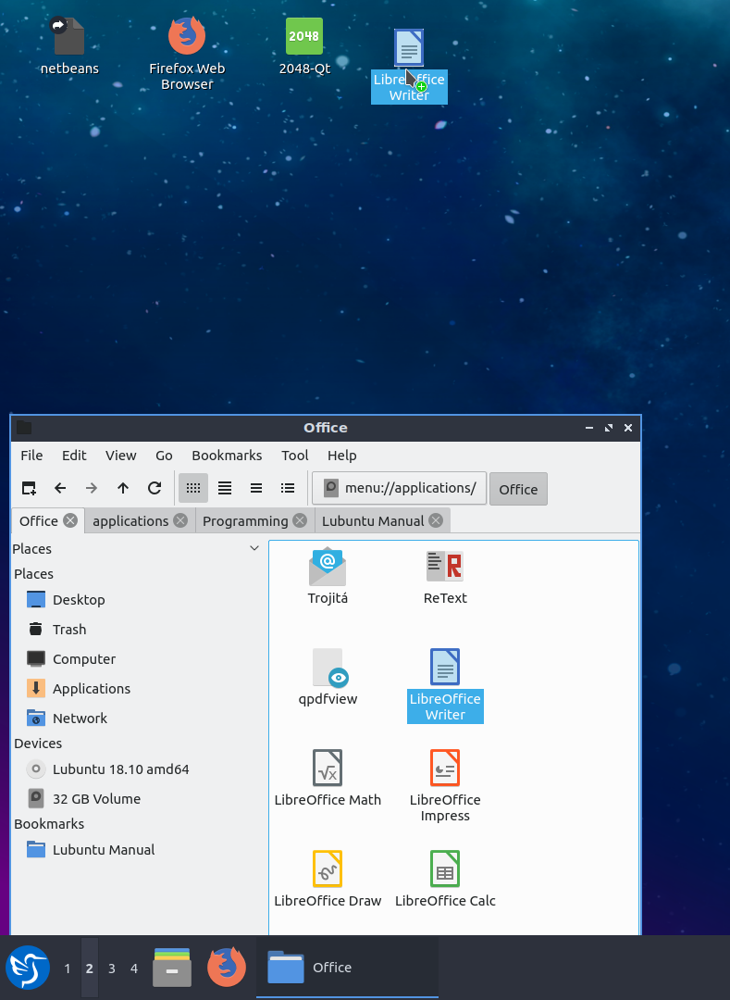

Chapter 5.2 Desktop Icons
=========================

The icons on your desktop can be moved by left clicking, holding and dragging the desktop icon to the position you want it. Shortcuts or desktop entry files can be opened by double click on the icon. If you want to view or edit a desktop file say for launching an application is to right click on the icon open with and slect say a text editor like featherpad to open file. 

Adding and removing items from the desktop
------------------------------------------
1.  Shortcuts can be copied to the desktop by dragging and dropping them from the application menu. 
2.  You can also create shortcuts by dragging and dropping files and folders from the File manager onto the desktop.

To remove a desktop icon right click on the file and click move to trash.  

