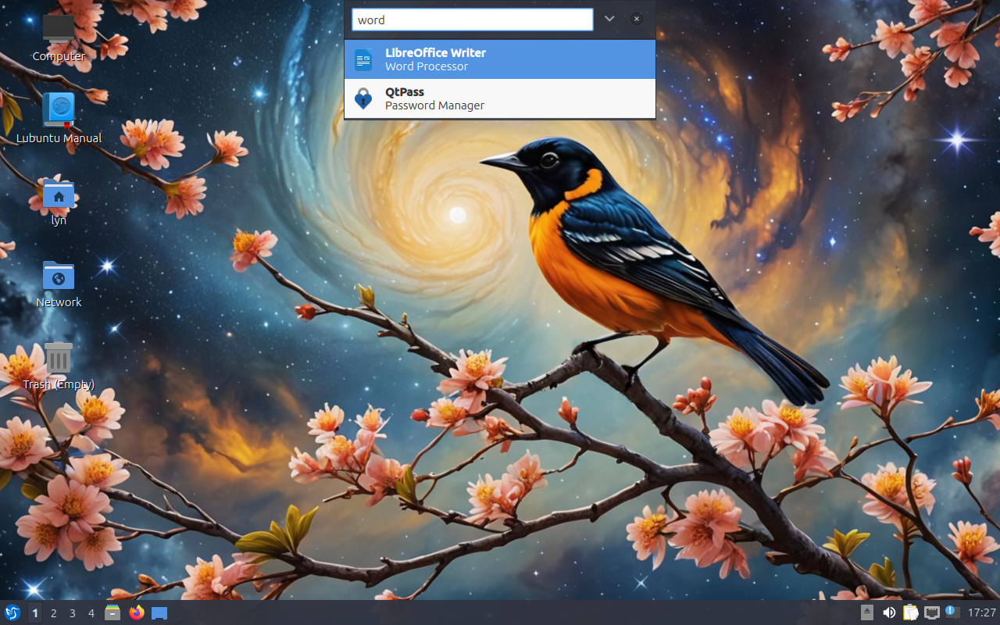
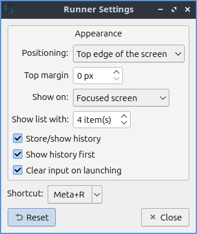

Chapter 5.3 Runner
=======================

Runner allows you to search for and launch applications and commands in the LXQt environment. It is a quick and convenient way of finding what you're looking for and launching it quickly.

Usage
------

To search for a program, press :kbd:`Super(windows)+R` and start typing a command. The search results will show below, similar to address bar behavior in browsers. All installed applications can be launched this way and Runner can be configured to store a history of recent programs. If you want to clear history open the downward pointing arrow and select :menuselection:`Clear History`. The runner even lets you logout, shutdown, or other ways to leave your session through the runner. Also keep in mind you do not have to search for the start of an application like inputting :kbd:`grab` will show results for ScreenGrab. To paste a command to run into the runner press :kbd:`Control +V` or right click on the runner and select :menuselection:`Paste`. To change to the last result of what you are searching for press :kbd:`End`. To move to the first result press :kbd:`Home`.

Runner can also work as a calculator if you put for example :kbd:`2+2=` and you will get the answer. To add numbers together with the calculator enter the :kbd:`+` in the bar. To subtract numbers together with the calculator enter the :kbd:`-` in the bar. To multiply numbers enter :kbd:`*` into the bar. To divide numbers in runner enter :kbd:`/` into the bar. To exponentiate enter :kbd:`^` into the bar. To actually get the result you will need to put a :kbd:`=` at the end. After typing :kbd:`=` the result will be copied to your clipboard.  

You can also leave your session with lxqt-runner. To shut your computer all the way down press the button that looks like a downward pointing arrow and select :menuselection:`Shutdown`. To suspend your system press the downward pointing arrow and select :menuselection:`Suspend`. To reboot your system press the downward pointing arrow and select :menuselection:`Reboot`. To logout of your system press the downward pointed arrow and select :menuselection:`Logout`. To lock your screen from the runner press the downward pointing arrow and select :menuselection:`Lock Screen`. If you decide against running something press the :kbd:`Escape` key or click on the :guilabel:`x` button.

Screenshot
---------------

Configuration
-------------

Runner has a few configuration options. If you want to change the keyboard shortcut to launch programs, click the downward arrow on the right side of the search bar to open up the menu and select the gear icon to :menuselection:`Configure`. To change where the runner appears to the center change :guilabel:`Positioning` drop down menu. To choose which monitor to put the runner on change the :guilabel:`Show On` drop down menu. To select to show the monitor on the currently focused monitor select :menuselection:`Focused screen` from the :guilabel:`Show on` menu. To change how many results are shown when you show a result for runner change the :guilabel:`Show list with x item(s)` field. In this screen there is a  checkbox for :guilabel:`Store/show history`. If you want to show history first check the :guilabel:`Show history first` checkbox. To change the shortcut press the :guilabel:`Shortcut` button and a countdown will begin in which time you need to press the key or combination of keystrokes you want to launch lxqt-runner.  To reset your changes in this window press the :guilabel:`Reset` button. 

How to launch
-------------
Runner should be running in the background and :kbd:`Super(windows)+R` should bring it forward to launch an application. If you need to manually start it for some reason run 

.. code::

   lxqt-runner 
   
from the command line. 
