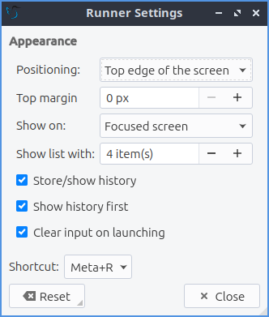

Chapter 5.3 Runner
=======================

Runner allows you to search for and launch applications and commands in the LXQt environment. It is a quick and convenient way of finding what you're looking for.

Usage
------

To search for a program, press :kbd:`Alt + F2` and start typing a command. The search results will show below, similar to address bar behavior in browsers. All installed applications can be launched this way and lxqt-runner can configured to store a history of recent programs. If you want to clear history open the downard pointing menu :menuselection:`Clear History`. The runner even lets you logout, shutdown, or other ways to leave your session through the runner. Also keep in mind you do not have to search for the start of an application like inputting :kbd:`shot` will show results for screenshot. 

Configuration
-------------

Runner has a few configuration options. If you want to change the keyboard shortcut to launch programs, click the the downward arrow on the right side of the search bar to open up the menu. Select the gear icon to configure, at the bottom there is a label that says shortcut and then a button that lists the current shortcut. Left click on the button and a countdown will begin in which time you need to press the key or combination of keystrokes you want to launch lxqt-runner. In this screen there are also tick-boxes to keep a history of your commands and if you want the historical items shown first. 

Screenshot
---------------

.. image:: runner.png

How to launch
-------------
Runner should be running in the background and :kbd:`Alt + F2` should bring it forward to launch an application. If you need to manually start it for some reason run 

.. code::

   lxqt-runner 
   
from the command line. 

