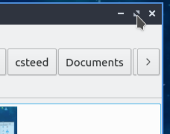
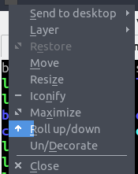

Chapter 5.4 Window Management
=============================

Window are the area which contains the graphical user interface that we interact with programs. In Lubuntu these windows can typically be opened, closed, resized and minimized. Underneath Lubuntu uses Openbox as default a window manager. 

Using the mouse
---------------
In the top-right corner of a windows a few commands allow you basic controls of the window. Starting from left to right

-   Iconify (-) hides/minimizes the window making it only appear on the task bar of the Panel. It can be recalled by clicking on the application on the task bar, or cycling through open windows with :kbd:`ALT + Tab`. Another way to iconify is to middle click on the tittlebar. 
-   Maximize reshapes the window to fix the entire screen.
-   Close (x) attempts to end the window and probably the program.

The window can be moved by by clicking on the title-bar and dragging the mouse or from the menu on the titlebar select :menuselection:`Move`. Windows can be minimized by middle clicking on the titlebar with the mouse. You can resize the window by grabbing the border (sides or corners which should be highlighted in blue) and dragging or from the menu on the titlebar select :menuselection:`Resize`. 

Right clicking on the title bar or left clicking on the icon in the top-left of the window brings the window management menu. Here you can:

-   Using :menuselection:`Send to desktop`, send the window to a virtual desktop of your choice or All Desktop
-   Using :menuselection:`Layer` option allows you to set  whether this windows the layer to :menuselection:`Always on top`, etc. 
-   If you want to move something to always show to bottom or you can move it back to normal. 
-   The earlier mentioned :menuselection:`Iconify`, :menuselection:`Maximize`, and :menuselection:`Close`  options are also available here.
-   :menuselection:`Roll up/down` rolls the window into the title-bar.
-   :menuselection:`Un/Decorate` hides them title-bar.
-   :menuselection:`Resize` lets you use the change the size of a window.

Useful keyboard shortcuts
-------------------------
-   Closing a window :kbd:`Alt + F4`
-   Switching through windows :kbd:`Hold Alt + hit Tab`
-   To switch between tabs in the reverse direction :kbd:`Hold Alt + Shift+Tab`
-   Show desktop with :kbd:`Control + Alt + D`.  

Virtual Desktop Switching
-------------------------
To switch to the next virtual desktop press :kbd:`Control +Alt + Right arrow`. To shift to the previous virtual desktop press :kbd:`Control+ Alt + Left Arrow`. To Do this with a combination of mouse wheel and keyboard :kbd:`Alt+ Mousewheel`.

