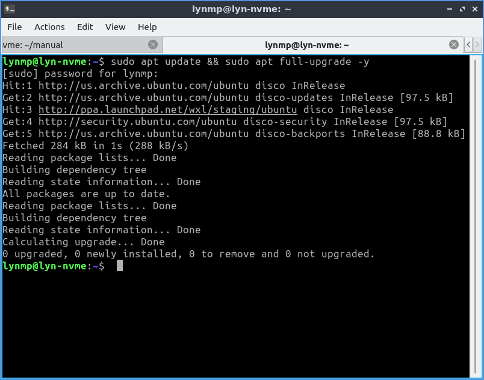

********************************************
Appendix D Upgrading from previous releases
********************************************

With every release upgrade comes many changes across the entire landscape of packages. Naturally, an extremely large change like this can cause problems, so **we strongly recommend you back up your files**. Also, if your computer is one that runs on a battery (such as a laptop), please ensure that the power is connected, as it may take a while and unexpected power failures could be disastrous. Also keep in mind upgrading from a previous release will download will take time and data.

This way of upgrading involves the command line and is also useful for server upgrades. Unfortunately with main Ubuntu and Lubuntu dropping 32-bit upgrades, 32-bit upgrades after Lubuntu 18.04 are not supported.

.. note:: 

  Upgrading will keep all of your files in your home folder and configuration files intact however this will mean some changes to default keybindings for example will still be the same as when you installed but will keep all of your customizations different from reinstalling from an iso again.

Upgrading with command line
---------------------------
The first step will be to ensure your system is up to date. This can be done by entering the following command into the terminal. If prompted, enter your password.

.. code::

    sudo apt update && sudo apt full-upgrade -y

Once the software upgrade has completed, you want to restart your PC. This can be done in a number of ways however, the following command is the simplest.

.. code::

    sudo reboot

The next thing you want to do is do the release upgrade. do-release-upgrade is the command line tool for upgrading Lubuntu installations. To run it, you need root privileges, which, from the command line means prefixing the command with sudo. Upgrades to a new operating system version can sometimes cause problems; so **always backup your files beforehand**. 

.. code::

    sudo do-release-upgrade

You may be prompted "No new release found", if so follow this step, else skip it. Go into software sources by :menuselection:`Preferences --> Software Sources` and on the :guilabel:`Updates` tab change :guilabel:`Show new distribution releases` and select :menuselection:`Normal Releases`.

After the installation, reboot into the newly upgraded system and log in and enjoy your upgraded release of Lubuntu. 
