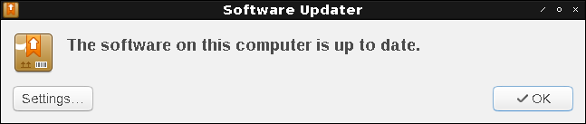
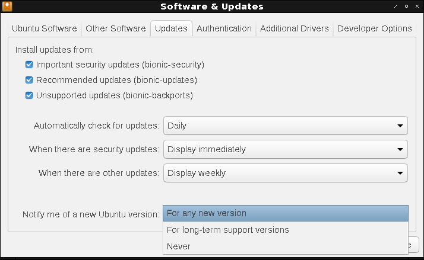
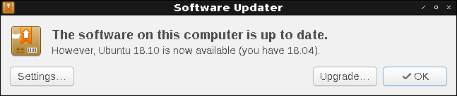
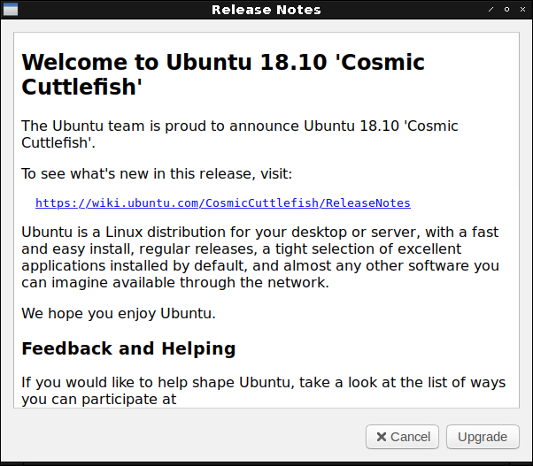

Appendix D Upgrading from previous releases
===========================================

We are proud to present the highly anticipated release of Lubuntu 18.10! This release comes with many changes, which will probably be overshadowed by the move to the LXQt desktop environment. Naturally, an extremely large change like this can cause problems, so **we strongly recommend you back up your files**. Also, if your computer is one that runs on a battery (such as a laptop), please ensure that the power is connected, as it may take a while and unexpected power failures could be disasterous.

There are two methods of upgrading Lubuntu releases. The first is using the update manager a graphical user interface. The second involves the command line and is useful for server upgrades.

Upgrading with GUI
------------------

First, ensure your system is up-to-date by starting Software Updater and performing system updates:
    - This can be done by clicking the Menu (Alt + F1) -> System Tools -> Software Updater.
    - When prompted, click Install Now.
    - After the install is completed you may be prompted to reboot. If not, reboot manually.

Since 18.10 is not an LTS (Long Term Support) release, you may have to opt in for non LTS versions of Lubuntu.
    - Select the Updates -> Notify me of a new Ubuntu version -> For any new version, from Software and Updates.
    - Close the update manager, and you should be prompted to upgrade to the latest release.
    - Alternatively, you can start a terminal (Ctrl + Alt + T) and type in the command "update-manager -d"
    - The -d flag is referring to the fact that it's moving to an unsupported release (if you are on the LTS track, this is accurate).

Next, you will want to upgrade to the new release.
    - After rebooting, start the update manager.
    - This can be done by clicking the Menu (Alt + F1) -> Preferences -> Software and Updates.
    - You should be prompted to upgrade. Click upgrade.
    - Read the release notes. **This is important, in case there is information you need to know.**
    - Once the upgrade has completed, restart your machine.

Upgrading with command line
---------------------------
The first step will be to ensure your system is up to date. This can be done by entering the following command into the terminal. If prompted, enter your password.

.. code::

    sudo apt update && sudo apt full-upgrade -y

Once the software upgrade has completed, you want to restart your pc. This can be done in a number of ways, however the following command is the simplest.

.. code::

    sudo reboot

The next thing you want to do is do the release upgrade. do-release-upgrade is the command line tool for upgrading Lubuntu installations. To run it, you need root privileges, which, from the command line means prefixing the command with sudo. Upgrades to a new operating system version can sometimes cause problems, so **always backup your files beforehand**. Since Lubuntu 18.10 switches to LXQt from the previous LXDE releases, this upgrade is large and can cause problems. You need to remove the (now unsupported) LXDE packages which clutter your system after the install. Enter the following command into your terminal:

.. code::

    sudo do-release-upgrade

You may be prompted "No new release found", if so follow this step, else skip it.

Since Lubuntu 18.04 was a long term support release, you will have to opt-in to install the regular releases. **It is important that you keep your software up-to-date in these releases as they are more featureful and get regular security updates.** In Software and Updates (Menu -> Preferences -> Software & Updates), on the Updates tab, Notify me of a new Ubuntu version and select **For any new version**. Enter your password to authenticate this choice. The software and updates manager edits the "/etc/update-manager/release-upgrades" file, and sets "Prompt=normal".

Now, update your software and run do-release-upgrade in a terminal, basically starting the process over.

During the release upgrade, several changes will take place. You will be asked to select a display manager, the new default is Simple Desktop Display Manager (SDDM). This will happen in the middle of the install, so don't walk away until after you have done this. The upgrade will remove several more obsolete packages.

After the installation, reboot into the new 18.10 system. You be greeted by a new login screen that is the SDDM display manager and a notification that this is now your first time running LXQt Power Management.

Many of the old applications will not be removed. Newer and often times more featureful, Qt-based applications with the same functionality are installed during the upgrade. Having many unnecessary applications could bloat your system and isn't the true Lubuntu experience, so uninstalling them may be a good idea. The following command will remove unnecessary applications:

.. code::

    sudo apt purge leafpad file-roller galculator gpicview xpad xfburn simple-scan mtpaint pidgin sylpheed transmission-gtk abiword evince gnumeric audacious gnome-mpv guvcview pcmanfm gdebi lxterminal hardinfo lightdm lxpanel lxsession obconf gnome-software gnome-disk-utility system-config-printer-gnome lxhotkey-gtk synaptic update-manager lxpolkit lxtask lxshortcut blueman usb-creator-gtk

To remove uneeded dependencies enter the following command:

.. code::

    sudo apt autoremove
