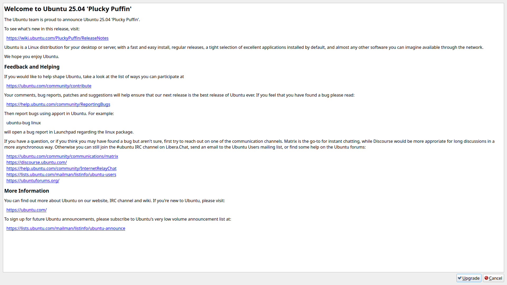

********************************************
Appendix D Upgrading from Previous Releases
********************************************

With every release upgrade comes many changes across the entire landscape of packages. Naturally, an extremely large change like this can cause problems, so **we strongly recommend you back up your files**. Also, if your computer runs on a battery (such as a laptop), please ensure that the power is connected, as it may take a while and unexpected power failures could be disastrous. Also keep in mind upgrading from a previous release will download will take time and data.

This way of upgrading involves the command line and is also useful for server upgrades. Unfortunately with main Ubuntu and Lubuntu dropping 32-bit upgrades, 32-bit upgrades after Lubuntu 18.04 are not supported.

.. note:: 

  Upgrading will keep all of your files in your home folder and configuration files intact however this will mean some changes to default keybindings for example will still be the same as when you installed but will keep all of your customizations different from reinstalling Lubuntu.

Upgrading with command line
---------------------------
The first step will be to ensure your system is up to date. This can be done by entering the following command into the terminal. If prompted, enter your password. Another way updating is running the graphical updater from :menuselection:`Preferences --> Apply Full Upgrade`.

.. code::

    sudo apt update && sudo apt full-upgrade 

.. image:: terminal_upgrade.png

Once the software upgrade has completed, you need to restart your PC. This can be done in a number of ways however, the following command is the simplest.

.. code::

    sudo reboot

The next thing you want to do is do the release upgrade command. do-release-upgrade is the command line tool for upgrading Lubuntu installations. To run it, you need root privileges, which, from the command line means prefixing the command with sudo. Upgrades to a new operating system version can sometimes cause problems; so **always backup your files beforehand**. 

.. code::

    sudo do-release-upgrade

You may be prompted "No new release found", if so follow this step, else skip it. Go into software sources by :menuselection:`Preferences --> Software Sources` and on the :guilabel:`Updates` tab change :guilabel:`Show new distribution releases` and select :menuselection:`Normal Releases`. If you want to stay on the Long Term Support release  from the :guilabel:`Updates` tab in :guilabel:`Show new distribution releases` select :guilabel:`Long term support releases only`.

While running the command line upgrade you will see what a chance to Cancel the installation, Continue, or see Details of what will change. To see details of what will change press :kbd:`d`. To get back to the choice  of whether to upgrade from viewing the details of changes press :kbd:`q`. To cancel the upgrade press :kbd:`N`. To actually do the upgrade press :kbd:`y`. After pressing y the command line upgrader will download all the new software versions and then install new versions. Some things like a screensaver may need to be prompted to be restarted after you upgrade the package. After the new packages are installed you be asked to continue to remove unneeded packages. To remove the unneeded old packages press :kbd:`y`. To view details on what will be removed press :kbd:`d`.

After the installation, reboot into the newly upgraded system and log in and enjoy your upgraded release of Lubuntu. 

Upgrading Graphically
---------------------

First make sure all of your current packages are up to date on the release you are upgrading. To do manually check for updates :menuselection:`Prefrences --> Apply Full Upgrade`. To upgrade lubuntu graphically when prompted for an upgrade press the :guilabel:`Apply` button when you are prompted. 

.. image:: apply-new-version.jpg

To launch the graphical version of the upgrade from the command line after upgrading

.. code::

    do-release-upgrade -m desktop -f DistUpgradeViewKDE
    
Once this is launched you will be brought to a window that shows you welcome to the next release. To start the release press the :guilabel:`Upgrade` button. 
    

After this the upgrader will download what it needs to calculate what to download to complete the update. To see what changes will be made press the :guilabel:`Details` button. To see how long donwloading an upgrade will take will be in the text in the middle of the window. If you want to decide not to upgrade at this time press the :guilabel:`Cancel` button. To actually  start upgrading to the next version press the :guilabel:`Start Upgrade` button.
