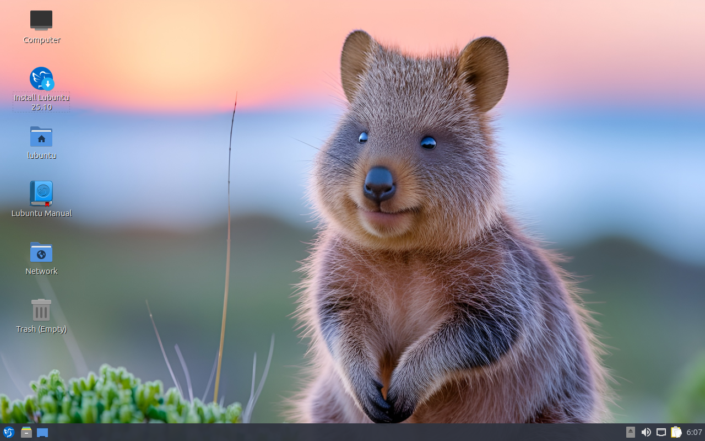

************************
Appendix E Live Session
************************

It is possible to use Lubuntu without installing it. In a live session your computer is running off a bootable media (USB, CD, or DVD). The session can also be used to install Lubuntu.

Reasons for using live session:
 -  Hardware testing and trouble shooting.
 -  OS testing.
 -  Fixing broken installs.
 -  Backing up files

A good example of when you would use a live session is if your computer turns on and won't boot, you can run the live session. You could then mount the disk and backup all of your pictures or send an email. If your hard drive or SSD is no longer working, you can boot a live session and then order replacement parts. You also can feel free to try different things out in a live session and not worry about breaking your install.

.. warning::
 In a live session anything you do not save to external media or a mounted drive specifically will be lost when you power off your machine.

A live session will not save your things to disk but will not by default mess up your installed system. This is not the case if you mount your filesystems on your disk and save to that location. By default the live session uses UTC as the time by default.

Screenshot
----------

